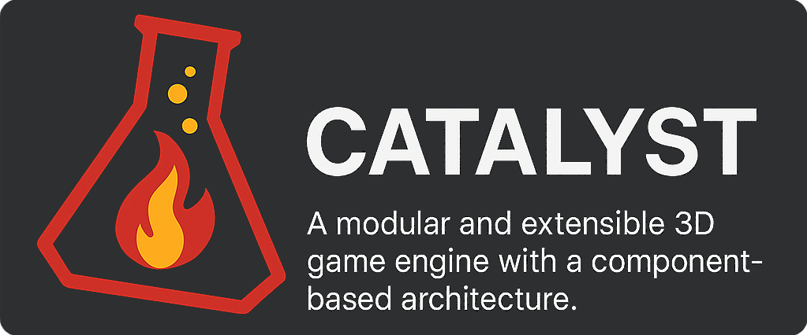

<p align="center">
  
</p>

# Catalyst Game Engine

**Catalyst** is a proprietary, modular, and extensible **3D game engine** built with modern **C++** and inspired by the architecture and editor-first workflow of **Unreal Engine 5**. Designed for flexibility, performance, and developer control, Catalyst emphasizes clean modular design, custom shader development, and a powerful ImGui-based editor interface.

> ⚠️ **Notice**  
> This repository is **private** and governed by a **proprietary license**. Contributions are not permitted unless explicitly authorized.

---

## ✨ Features at a Glance

### 🧱 Architecture & Design
- **Modular Engine Structure** – Core, Graphics, Physics, Input, Scripting, and more.
- **CMake-Based Build System** – All modules built as shared libraries: `catalyst.[module]`.
- **Editor-First Workflow** – The **Catalyst-Editor** mimics UE5’s layout and prioritizes in-editor development.
- **Lightweight UI with ImGui** – Uses the docking branch for modern UI panels and custom editors.

### 🖼️ Rendering & Shaders
- **Custom GLSL Shader System**
  - Single shader file per material with Unity-style properties.
  - Dynamic shader stage tagging.
  - Auto-injected `ProjectionViewModel` and `ModelMatrix` uniforms.
  - Clean organization with `Properties`, `Input`, and `Output` blocks.
- **OpenGL 4.x** + **GLFW**, with **GLAD** for function loading.

### 🎮 Scripting & Gameplay
- **Component-Based Architecture** – Built for flexible and reusable game logic.
- **Compile-Time Reflection (Planned)** – Enables dynamic introspection of components in-editor.

### 🧩 Dependencies
All non-header-only dependencies are managed using `FetchContent_Declare` and built as shared libraries.

- **Rendering & UI**: GLFW, GLAD, Dear ImGui (Docking)
- **Physics**: ReactPhysics3D
- **Asset Importing**: Assimp
- **Math & Utility**: GLM, STB_image
- **Serialization**: nlohmann::json, PugiXML, RapidYAML

---

## 🛠️ Getting Started

Catalyst is distributed via a prebuilt installer.

1. **Download & Install Catalyst** from the official distribution.
2. **Create a new project file** (`.catprj`) for your game:

```json
{
  "name": "Project Name",
  "version": [1, 0, 0],
  "domain": "com.company.projectname"
}
```

3. Launch the **Catalyst-Editor**, open your `.catprj` file, and start building your game world.

---

## 📷 Screenshots

> *Editor UI, real-time rendering, and asset browser previews coming soon.*


---

## 📄 License

This project is governed by a **proprietary license**. See [LICENSE](./LICENSE) for details.  
Unauthorized use, copying, or redistribution is strictly prohibited.

---

## 🙅 Contribution Policy

Catalyst is a **closed-source** project. Contributions, pull requests, and issues are not accepted unless you're part of the authorized team or organization.

---

Made with ❤️ in modern C++